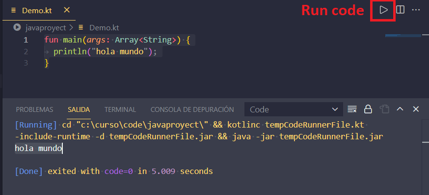

# Instalación y configuración del compilador Kotlin, en Visual Studio Code
***
## 1. Pre requisitos

* <strong><em><a href="https://code.visualstudio.com/Download" target="_blank">Visual Studio Code</a></em></strong> instalado

* Plugins de <strong><em><a href="https://marketplace.visualstudio.com/items?itemName=mathiasfrohlich.Kotlin" target="_blank">Kotlin</a></em></strong> y <strong><em><a href="https://marketplace.visualstudio.com/items?itemName=formulahendry.code-runner" target="_blank">Code Runner</a></em></strong> instalados

<p align="center">
	<a href="https://marketplace.visualstudio.com/items?itemName=mathiasfrohlich.Kotlin" target="_blank">
	
	</a>
</p>

<p align="center">
	<a href="https://marketplace.visualstudio.com/items?itemName=formulahendry.code-runner" target="_blank">
	
	</a>
</p>
***

## 2. Descargar y descomprimir el compilador de kotlin 
https://github.com/JetBrains/kotlin/releases/tag/v1.5.20

***


#### Instalación

1. Descargar el compilador **kotlinc**

<p align="center">
	
</p>

<p align="center">
	<strong><em>Compilador de kotlin para Windows</em></strong>
</p>
2. Descomprimir el archivo
  
<p align="center">
	
</p>

<p align="center">
	<strong><em>Descomprime el compilador kotlin en un directorio</em></strong>
</p>

#### Configurando las variables de entorno

1. Ingresar a variables de entorno a través del cuadro de busqueda de <strong><em>Window.</em></strong>


<p align="center">
	
</p>

<p align="center">
	<strong><em>Editar variables de entorno</em></strong>
</p>

2. Hacer clic en el botón <strong><em>Variables de entorno</em></strong>, ubicar la sección <strong><em>Variables de sistema</em></strong>, hacer clic sobre la variable <strong><em>path</em></strong> y luego clic en el botón <strong><em>Editar.</em></strong>

<p align="center">
	
</p>

<p align="center">
	<strong><em>Configurar variables de entorno</em></strong>
</p>

3. Modificar la variable <strong><em>path</em></strong>

<p align="center">
	
</p>

<p align="center">
	<strong><em>Modificar la variable path</em></strong>
</p>

4. Hacer clic en el botón Nuevo, e ingresar la ruta al directorio en donde se encuentra el compilador de Kotlin.
 
	**Ejemplo:**
 	```shell
 	<directorio instalacion de kotlin>/ bin
 
 	C:\software\kotlin-compiler-1.3.72\kotlinc\bin
 	```

5. Hacer clic sobre el botón Aceptar, y dos veces más sobre el botón Aceptar en los cuadros de dialogo previamente abiertos.
	
***


#### Instalaciòn Usando snap

```shell
  $ sudo snap install --classic kotlin
```

## 3. Iniciando  <strong><em><a href="https://code.visualstudio.com/Download" target="_blank">Visual Studio Code</a></em></strong>
	
* Iniciar <strong><em><a href="https://code.visualstudio.com/Download" target="_blank">Visual Studio Code</a></em></strong>, escribir programa básico:

``` kotlin
fun main(args: Array<String>) {
	println("hola mundo");
}
```
	
* Hacer clic en el botón <strong><em>Run code</em></strong>, o pulsar la combinación de teclas <strong><em>(Ctrl + Alt +N)</em></strong>
  
	
<p align="center">
	
</p>

<p align="center">
	<strong><em>Resultado en consola</em></strong>
</p>
